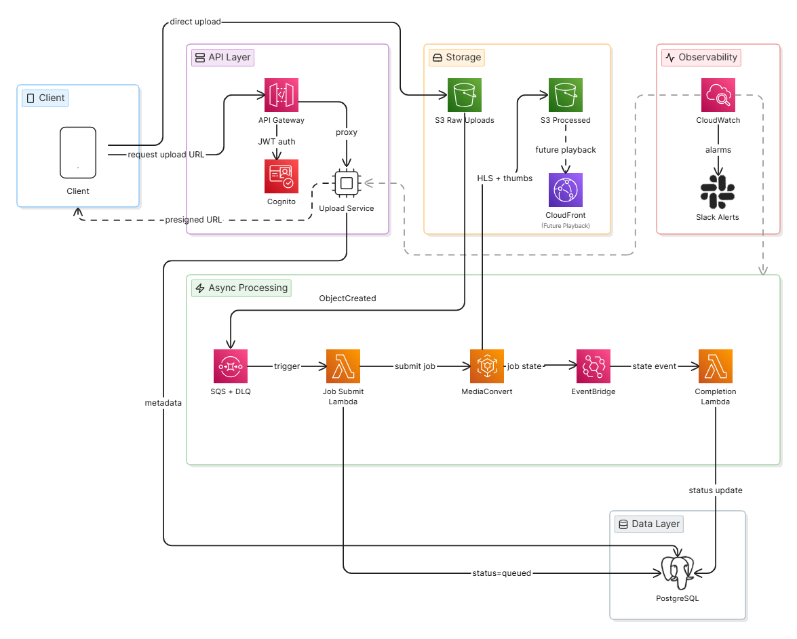

# System Architecture Diagram

The diagram shows the complete upload flow from client to playback-ready storage.



> **Future optimization path:** If transcoding costs become significant at scale or custom pipeline logic is needed, the MediaConvert step can be replaced with self-managed ECS Fargate workers running ffmpeg. See [`code/transcoding_worker.py`](../code/transcoding_worker.py) for a reference implementation.

---

## Component Descriptions

### API Gateway
- Single public entry point; validates Cognito JWTs before forwarding
- Rate limiting per user, TLS termination

### Upload Service (Node.js/TypeScript on ECS Fargate)
- Stateless REST service, min 2 tasks
- Resolves internal user ID from Cognito `sub` claim before creating records
- Generates presigned S3 PUT URLs (60-minute TTL) for single-file uploads
- Orchestrates S3 multipart upload sessions for large files (>100 MB)
- Creates video records in PostgreSQL (`pending`) on upload initiation
- Serves status polling directly from PostgreSQL
- Does **not** handle video bytes; does **not** receive MediaConvert callbacks

### Amazon S3 (raw-uploads)
- Receives video files directly from clients via presigned URL
- Fires `s3:ObjectCreated` to SQS on new uploads
- Lifecycle rule: expires raw objects 7 days after processing. The rule filters on the `status=processed` tag applied by the Completion Lambda on success — so only confirmed-processed objects are expired.
- For files above ~100 MB, clients should use S3 multipart upload. Each part gets its own presigned URL; the `ObjectCreated` event fires only after `CompleteMultipartUpload`, so the downstream pipeline is unchanged.

### SQS (transcoding-jobs)
- Decouples upload from transcoding; absorbs traffic spikes
- Standard queue, at-least-once delivery, visibility timeout 15 min
- DLQ after 3 failed attempts; CloudWatch alarm on DLQ depth > 0

### Job Submission Lambda
- Triggered by SQS; checks idempotency before submitting (skips if job already exists in `queued`, `processing`, or `completed` state)
- Submits MediaConvert job with `videoId` and `rawS3Key` in `UserMetadata`
- Updates video status to `queued`

### AWS MediaConvert
- Fully managed transcoding — no workers, no ffmpeg, no autoscaling to configure
- Produces HLS output at 360p, 720p, 1080p; extracts thumbnail in the same job
- Emits `PROGRESSING`, `COMPLETE`, and `ERROR` state change events via EventBridge
- Pay-per-minute; no idle compute cost

### EventBridge
- Routes MediaConvert job state changes (`PROGRESSING`, `COMPLETE`, `ERROR`) to the Completion Lambda
- Rule scoped to `aws.mediaconvert` source — no custom webhook infrastructure needed

### Completion Lambda
- `PROGRESSING` → sets video and job status to `processing`, records `started_at`
- `COMPLETE` → sets video status to `ready`, stores output paths and thumbnail URL, tags raw S3 object `status=processed` for lifecycle expiry (best-effort — tagging failure is logged but does not affect video status)
- `ERROR` → sets video status to `failed`, stores error message in `transcoding_jobs.error_msg`

### PostgreSQL (Amazon RDS)
- Stores video metadata, job status, and user associations
- Multi-AZ; status polling reads directly from this DB
- Schema: `videos`, `transcoding_jobs`, `users`

### CloudFront (CDN)
- Origin: `processed-videos` S3 bucket
- Serves HLS segments for playback — not in scope for the upload flow itself

---

## Status Lifecycle

```
Video:           pending → queued → processing → ready | failed
Transcoding job: queued  → processing → completed | failed
```

`ready` is the user-facing video state. `completed` is the internal transcoding job state set on a successful MediaConvert `COMPLETE` event.

---

## Post-Upload Validation

The presigned URL flow validates declared file size and MIME type *before* upload. But the actual S3 object may still be invalid — corrupted, mismatched content type, too long, or in an unsupported codec. Validation of the actual file happens during the processing step:

**What gets checked:**
- MediaConvert performs input validation when the job starts. If the file is unreadable, uses an unsupported codec, or is otherwise malformed, the job fails with an `ERROR` event and a descriptive error message.
- The Job Submission Lambda can optionally check S3 object metadata (actual size, content type) before submitting the job, rejecting obvious mismatches early.
- Duration limits (if enforced) can be checked via MediaConvert job settings or a lightweight ffprobe-style probe before submission.

**Failure behavior:**
- Video status is set to `failed` with a descriptive error stored in `transcoding_jobs.error_msg`.
- No playback URLs are exposed — the status endpoint returns the error to the client.
- The raw S3 object is not tagged `status=processed`, so it remains subject to the 7-day lifecycle expiry. For egregious violations (e.g., non-video file), the object could be deleted immediately or moved to a quarantine prefix.

This approach keeps validation simple — MediaConvert itself is the primary validator, and explicit failures are surfaced through the existing status lifecycle without adding a separate validation service.

---

## Data Model

```sql
CREATE TABLE users (
    id          UUID PRIMARY KEY DEFAULT gen_random_uuid(),
    cognito_sub VARCHAR(255) UNIQUE NOT NULL,
    email       VARCHAR(255) UNIQUE NOT NULL,
    created_at  TIMESTAMPTZ DEFAULT NOW()
);

CREATE TABLE videos (
    id               UUID PRIMARY KEY DEFAULT gen_random_uuid(),
    user_id          UUID NOT NULL REFERENCES users(id),
    title            VARCHAR(500),
    description      TEXT,
    status           VARCHAR(50) NOT NULL DEFAULT 'pending',
                     -- pending | queued | processing | ready | failed
    raw_s3_key       VARCHAR(1000),
    output_s3_prefix VARCHAR(1000),
    thumbnail_url    VARCHAR(1000),
    duration_seconds INTEGER,
    file_size_bytes  BIGINT,
    created_at       TIMESTAMPTZ DEFAULT NOW(),
    updated_at       TIMESTAMPTZ DEFAULT NOW()
);

CREATE TABLE transcoding_jobs (
    id                  UUID PRIMARY KEY DEFAULT gen_random_uuid(),
    video_id            UUID NOT NULL REFERENCES videos(id),
    mediaconvert_job_id VARCHAR(255),          -- MediaConvert job ARN/ID
    status              VARCHAR(50) NOT NULL DEFAULT 'queued',
                        -- queued | processing | completed | failed
    attempts            INTEGER DEFAULT 0,
    error_msg           TEXT,
    started_at          TIMESTAMPTZ,
    completed_at        TIMESTAMPTZ,
    created_at          TIMESTAMPTZ DEFAULT NOW()
);

CREATE INDEX idx_videos_user_id ON videos(user_id);
CREATE INDEX idx_videos_status  ON videos(status);
CREATE INDEX idx_jobs_video_id  ON transcoding_jobs(video_id);
```
